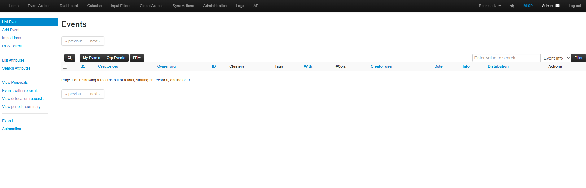

# 🔐 SIEM Lab - Part 2: MISP Core Installation

This phase introduces [MISP (Malware Information Sharing Platform)](https://www.misp-project.org/), an open-source threat intelligence platform. It enables sharing, storing, and correlating indicators of compromise (IOCs) for improved detection and response.

---

## 📦 Installation Steps

### 🔽 1. Download and Run Installer

```bash
wget -O /tmp/INSTALL.sh https://raw.githubusercontent.com/MISP/MISP/2.4/INSTALL/INSTALL.sh
bash /tmp/INSTALL.sh

# 💡 For a customized installation, use:
bash /tmp/INSTALL.sh -A
```

---

### ⚙️ 2. Service & Port Validation

After installation, validate the following:

#### 🧪 Apache Status

```bash
sudo systemctl status apache2
```

Expected output:

```
● apache2.service - The Apache HTTP Server
     Active: active (running)
     ...
```

#### 🌐 HTTP Redirection Check

```bash
curl -I http://localhost
curl -I http://192.168.0.101
```

Expected:

```
HTTP/1.1 302 Found
Location: https://...
```

#### 📡 Listening Ports

```bash
sudo ss -tuln | grep 80
```

Expected:

```
tcp   LISTEN 0      511     *:80     *:*
```

---

### ✅ 3. Accessing MISP

🌐 Access MISP at: https://192.168.0.101

🔐 Default credentials:

- **User**: admin@admin.test
- **Password**: admin

🧾 Screenshot



