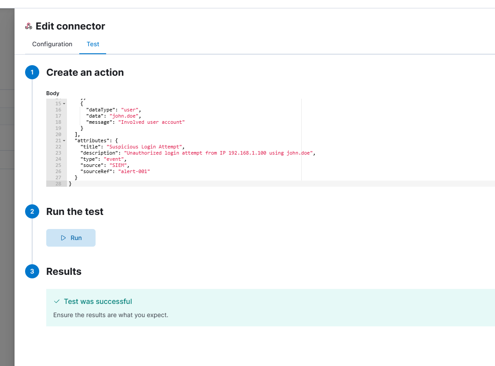
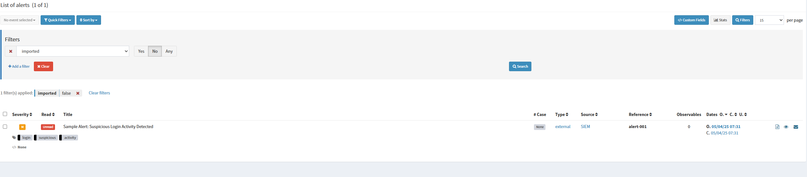

# TheHive Integration with Elasticsearch - Webhook Alert Injection

This guide outlines the steps to configure and test a webhook integration that allows alerts to be sent from an external system (e.g. SIEM) to TheHive using its `/api/alert` endpoint.

---

## 🔧 Prerequisites

* TheHive 4.x installed and accessible (e.g., `http://192.168.0.103:9000`)
* An organization created (e.g., `SOC`)
* A user with an API key (role: `org-admin`) generated in TheHive
* Elasticsearch configured and working with TheHive (for alert indexing)

---

## 🏢 TheHive Setup Steps

### 1. Create Organization

* Go to **Admin > Organisations**
* Create a new organization named `SOC`

### 2. Create a Profile

* Go to **Admin > Profiles**
* Create a profile named `org-admin` with the following permissions:

  * `accessTheHiveFS`, `manageAction`, `manageAlert`, `manageAnalyse`, `manageCase`, `manageCaseTemplate`, `manageConfig`, `manageObservable`, `managePage`, `manageProcedure`, `manageShare`, `manageTag`, `manageTask`, `manageUser`

### 3. Create a User

* Go to **Admin > Users**
* Add a user with:

  * **Login**: `SOCL1@seclabjmc.com`
  * **Full name**: `Jordan Mora`
  * **Profile**: `org-admin`
* Save the user and click **Create API Key**

---

## 🚀 Webhook Connector Configuration (via Elastic or 3rd-party)

### Endpoint Setup:

```
Method: POST
URL: http://192.168.0.103:9000/api/alert
Headers:
  Content-Type: application/json
  Authorization: Bearer <Your_TheHive_API_Key>
```

---

## ✉️ Test Payload Example

```json
{
  "artifacts": [
    {
      "dataType": "user",
      "data": "john.doe",
      "message": "Involved user account"
    }
  ],
  "attributes": {
    "title": "Suspicious Login Attempt",
    "description": "Unauthorized login attempt from IP 192.168.1.100 using john.doe",
    "type": "event",
    "source": "SIEM",
    "sourceRef": "alert-001"
  }
}
```

---

## 📊 Results

### ✅ Test Result (Webhook Connector)



### ✅ Alert Visible in TheHive UI



---

## 🔐 Tips & Notes

* Use `/api/case` for direct case creation instead of alerts.
* Ensure the API key belongs to the same organization where the alert is being pushed.
* Confirm Elasticsearch is correctly indexed by checking logs or UI.

---

## 🚀 Reference Version

* TheHive: 4.1.24-1
* Elasticsearch: 8.x (used by TheHive backend)

---

Jordan Moran Cabello  
SOC Engineer & Lab Developer
