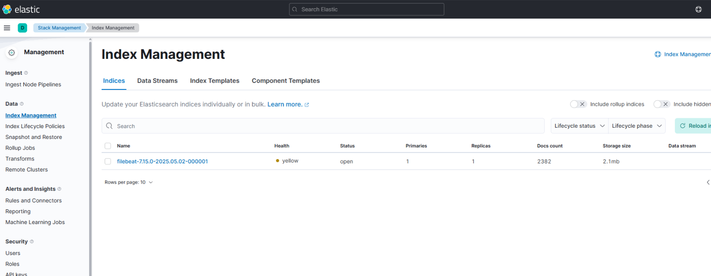
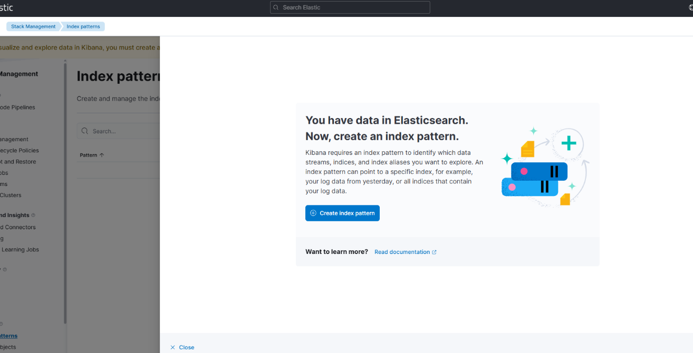
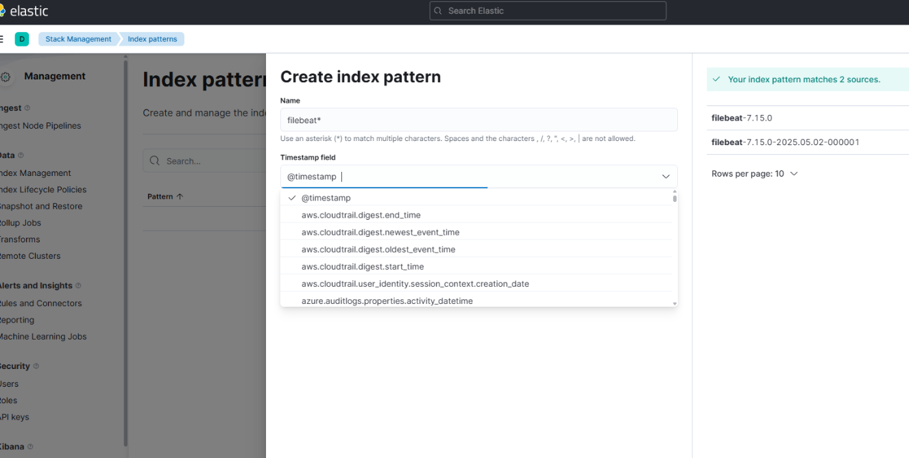
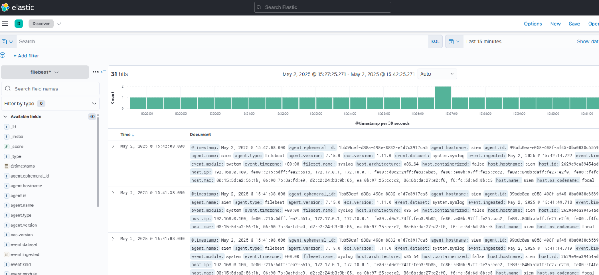

# 🛡️ Elastic SIEM Lab - Part 1: Elasticsearch, Kibana, and Filebeat Setup

This project is the first phase of my hands-on **Security Information and Event Management (SIEM)** lab environment, designed to simulate real-world cybersecurity monitoring and detection workflows.  
The goal is to build a fully functional **SOC (Security Operations Center)** where logs from various devices and systems are collected, normalized, visualized, and analyzed for threats using **open-source technologies**.

---

## 📑 Table of Contents

- [🐧 1. Prerequisites and System Preparation](#-1-prerequisites-and-system-preparation)
- [🐳 2. Docker & Docker Compose Installation](#-2-docker--docker-compose-installation)
- [📦 3. Docker Compose: Elasticsearch Stack Setup](#-3-docker-compose-elasticsearch-stack-setup)
- [📄 4. Install and Configure Filebeat (on same VM)](#-4-install-and-configure-filebeat-on-same-vm)
- [📊 5. Kibana Configuration: Index Pattern](#-5-kibana-configuration-index-pattern)
- [📝 Summary](#-summary)
- [📷 Screenshots](#-screenshots)
- [🚧 Next Steps](#-next-steps)

---

## 🐧 1. Prerequisites and System Preparation

```bash
sudo apt update
sudo apt install ca-certificates curl gnupg -y
```

---

## 🐳 2. Docker & Docker Compose Installation

```bash
sudo install -m 0755 -d /etc/apt/keyrings
curl -fsSL https://download.docker.com/linux/ubuntu/gpg | sudo gpg --dearmor -o /etc/apt/keyrings/docker.gpg

echo   "deb [arch=$(dpkg --print-architecture) signed-by=/etc/apt/keyrings/docker.gpg]   https://download.docker.com/linux/ubuntu $(lsb_release -cs) stable" |   sudo tee /etc/apt/sources.list.d/docker.list > /dev/null

sudo apt update
sudo apt install docker-ce docker-ce-cli containerd.io docker-buildx-plugin docker-compose-plugin -y
```

---

## 📦 3. Docker Compose: Elasticsearch Stack Setup

> 📁 You can find the full `docker-compose.yml` file inside the `docker/` folder of this repository.

To start the containers:

```bash
cd docker/
sudo docker compose up -d
```

To validate services are up and vms were created succesfuly:

```bash
ss -tuln | grep 5601
tcp   LISTEN 0      4096                            0.0.0.0:5601        0.0.0.0:*
tcp   LISTEN 0      4096                               [::]:5601           [::]:*
```

```bash
ss -tuln | grep 9200
tcp   LISTEN 0      4096                            0.0.0.0:9200        0.0.0.0:*
tcp   LISTEN 0      4096                               [::]:9200           [::]:*
```
```bash
sudo docker ps
CONTAINER ID   IMAGE                                                          COMMAND                  CREATED       STATUS       PORTS                                                   NAMES
678d801df404   docker.elastic.co/kibana/kibana:7.15.0                         "/bin/tini -- /usr/l…"   9 hours ago   Up 9 hours   0.0.0.0:5601->5601/tcp, [::]:5601->5601/tcp             elasticsearch-kibana-1
9c2558ea5803   docker.elastic.co/enterprise-search/enterprise-search:7.15.0   "/bin/tini -- /usr/l…"   9 hours ago   Up 9 hours   0.0.0.0:3002->3002/tcp, [::]:3002->3002/tcp             elasticsearch-ent-search-1
797d0b1bdde6   docker.elastic.co/elasticsearch/elasticsearch:7.15.0           "/bin/tini -- /usr/l…"   9 hours ago   Up 9 hours   0.0.0.0:9200->9200/tcp, [::]:9200->9200/tcp, 9300/tcp   elasticsearch-elasticsearch-1
```

Access Kibana via browser at: `http://192.168.0.100:5601`

---

## 📄 4. Install and Configure Filebeat

### 🔽 Download and install:

```bash
curl -L -O https://artifacts.elastic.co/downloads/beats/filebeat/filebeat-7.15.0-amd64.deb
sudo dpkg -i filebeat-7.15.0-amd64.deb
```

### ⚙️ Configure Filebeat (`/etc/filebeat/filebeat.yml`):

```yaml
output.elasticsearch:
  hosts: ["192.168.0.100:9200"]
  protocol: "http"
  username: "elastic"
  password: "Elastic@123"

setup.kibana:
  host: "192.168.0.100:5601"
```

Enable system module:

```bash
cd /etc/filebeat/modules.d/
sudo filebeat modules enable system
```

Start Filebeat:

```bash
sudo service filebeat start
```

---

## 📊 5. Kibana Configuration: Index Pattern

1. Accessed `Stack Management > Index Patterns`
2. Created index pattern: `filebeat*`
3. Selected timestamp field: `@timestamp`

### ✅ Final Check

- Filebeat logs confirmed in Elasticsearch.
- Fields like `agent.hostname`, `event.dataset`, `host.ip`, etc. successfully parsed and visible in Kibana Discover tab.

---

## 📝 Summary

This completes the first stage of my open-source SIEM lab setup.  
Everything was built and tested locally on VM `192.168.0.100` using Docker containers.  
Next phases will include integrating Cortex and TheHive for automated incident response and enrichment.

---

## 📷 Screenshots

### 🟢 Elasticsearch API Check



### 📊 Kibana Dashboard



### 🗂️ Filebeat Index Pattern



### 🔍 Discover Tab



---


## 🚧 Next Steps

- Integrate **TheHive** and **Cortex** for case management and automated response.
- Add **MISP** to correlate with threat intelligence.
- Ingest logs from multiple machines and appliances.
